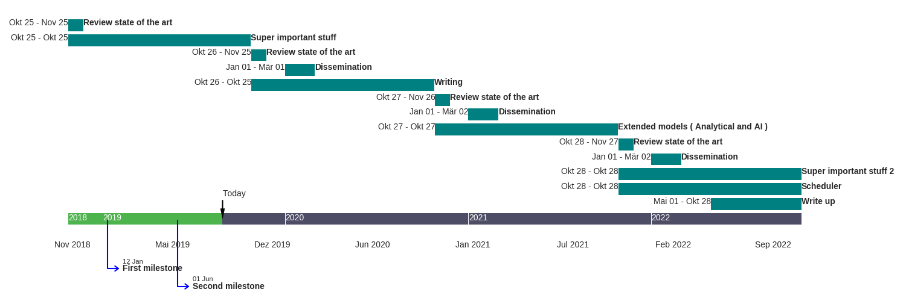

# simpletimeline
simple python script to create timeline


```python
from timeline import *

old_workplan= [
    event(begin=datetime(2018,10,25), end=datetime(2018,11,25),   text="Review state of the art"),
    event(begin=datetime(2018,10,25), duration=timedelta(days=365),  text="Super important stuff"),

    event(begin=datetime(2019,10,26), duration=timedelta(days=30),   text="Review state of the art"),
    event(begin=datetime(2020,1,1),  duration=timedelta(days=60),   text="Dissemination"),
    event(begin=datetime(2019,10,26), duration=timedelta(days=365),  text="Writing"),

    event(begin=datetime(2020,10,27), duration=timedelta(days=30),   text="Review state of the art"),
    event(begin=datetime(2021,1,1),  duration=timedelta(days=60),   text="Dissemination"),
    event(begin=datetime(2020,10,27), duration=timedelta(days=365),  text="Extended models ( Analytical and AI )"),

    event(begin=datetime(2021,10,28), duration=timedelta(days=30),   text="Review state of the art"),
    event(begin=datetime(2022,1,1),  duration=timedelta(days=60),   text="Dissemination"),
    event(begin=datetime(2021,10,28), duration=timedelta(days=365),  text="Super important stuff 2"),
    event(begin=datetime(2021,10,28), duration=timedelta(days=365),  text="Scheduler"),
    event(begin=datetime(2022,5,1), duration=timedelta(days=180),  text="Write up")
]
ms= [
    milestone(date=datetime(2019,1,12), text="First milestone"),
    milestone(date=datetime(2019,6,1), text="Second milestone")
]

workplan= timeline(old_workplan, ms)
workplan.plot_evs()
workplan.plot_timebar()
workplan.plot_today()
workplan.plot_mstone()
workplan.show()
```

